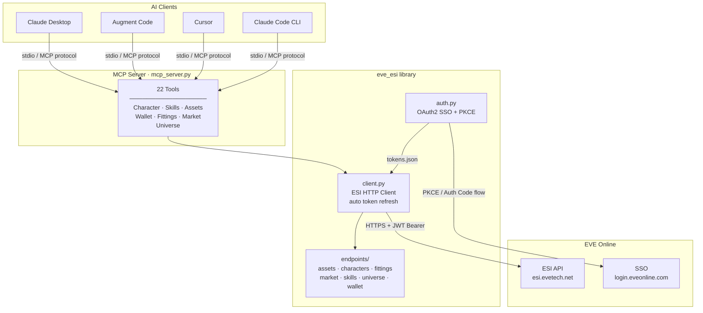
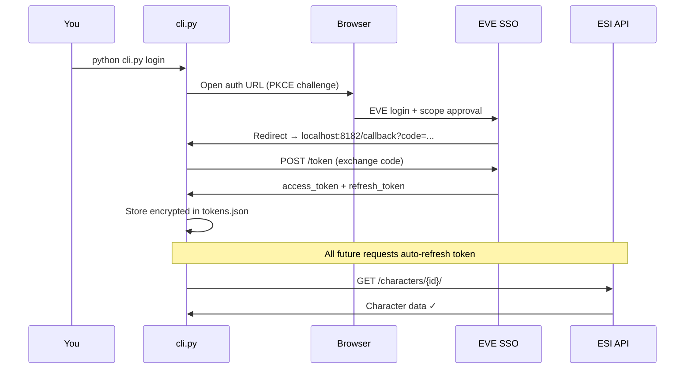
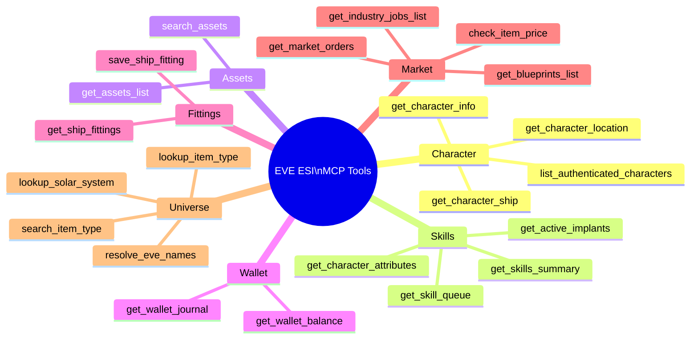

# EVE ESI Tool 🚀

An EVE Online ESI API interface with a **Model Context Protocol (MCP) server** for AI agent integration. Connect your EVE character to Claude, Augment Code, Cursor, or any MCP-compatible AI assistant — then ask questions like *"What's in my cargo hold?"*, *"Suggest a Hookbill fit for solo FW"*, or *"What are my most valuable assets?"*

---

## Architecture



## OAuth2 Authentication Flow



---

## Prerequisites

- **Python 3.11+**
- **An EVE Online account**
- **A registered EVE developer application** (free — takes 2 minutes at [developers.eveonline.com](https://developers.eveonline.com/))

---

## Installation

```bash
git clone https://github.com/yourname/eve-esi-tool
cd eve-esi-tool
pip install -e .
```

---

## Step 1 — Register an EVE Application

1. Go to [developers.eveonline.com](https://developers.eveonline.com/) → sign in → **Applications → Create Application**
2. Set **Connection Type** → `Authentication & API Access`
3. Set **Callback URL** → `http://localhost:8182/callback`
4. Add whichever ESI scopes you want (see [Scopes Reference](#scopes-reference) below)
5. Copy your **Client ID** and optionally **Client Secret**

> **PKCE vs Secret:** If you omit `client_secret` from `config.yaml`, the tool uses PKCE (safer for desktop apps). If you include it, it uses the standard Authorization Code flow with Basic Auth.

---

## Step 2 — Configure

```bash
cp config.example.yaml config.yaml
```

Edit `config.yaml`:

```yaml
eve_sso:
  client_id: "YOUR_CLIENT_ID_HERE"
  client_secret: "YOUR_SECRET_HERE"   # optional — remove for PKCE-only
  callback_url: "http://localhost:8182/callback"
  scopes:
    - "esi-skills.read_skills.v1"
    - "esi-skills.read_skillqueue.v1"
    - "esi-characters.read_blueprints.v1"
    - "esi-assets.read_assets.v1"
    - "esi-wallet.read_character_wallet.v1"
    - "esi-fittings.read_fittings.v1"
    - "esi-fittings.write_fittings.v1"
    - "esi-markets.read_character_orders.v1"
    - "esi-industry.read_character_jobs.v1"
    - "esi-location.read_location.v1"
    - "esi-location.read_ship_type.v1"
    - "esi-clones.read_clones.v1"
    - "esi-clones.read_implants.v1"
    - "esi-contracts.read_character_contracts.v1"
    - "esi-universe.read_structures.v1"

token_storage:
  path: "tokens.json"
```

---

## Step 3 — Log In

```bash
python cli.py login
```

A browser window opens for EVE SSO. After you approve, your tokens are saved to `tokens.json`. **Run this once per character.** You can authenticate multiple characters — all tools accept an optional `character_id` parameter.

---

## CLI Reference

```bash
python cli.py login    # Authenticate a character via EVE SSO
python cli.py chars    # List all authenticated characters
python cli.py info     # Show character info (corp, alliance, etc.)
python cli.py skills   # Show skill summary (total SP, top skills)
python cli.py wallet   # Show ISK wallet balance
python cli.py queue    # Show skill training queue
```

---

## Step 4 — Connect to Your AI Tool

The MCP server uses **stdio transport** — the AI client launches it as a subprocess and communicates over stdin/stdout.

### Augment Code (VS Code)

Open your VS Code user settings (Ctrl+Shift+P → **"Preferences: Open User Settings (JSON)"**) and add:

```json
{
  "augment.advanced": {
    "mcpServers": {
      "eve-esi": {
        "command": "python",
        "args": ["C:/path/to/eve-esi-tool/mcp_server.py"],
        "cwd": "C:/path/to/eve-esi-tool"
      }
    }
  }
}
```

Then reload VS Code (Ctrl+Shift+P → **"Developer: Reload Window"**). The EVE ESI tools will be available in Agent mode automatically.

> **Windows tip:** Use forward slashes `/` or double backslashes `\\` in the path.

---

### Claude Desktop

Edit `%APPDATA%\Claude\claude_desktop_config.json` on Windows, or `~/Library/Application Support/Claude/claude_desktop_config.json` on macOS. Create the file if it doesn't exist:

```json
{
  "mcpServers": {
    "eve-esi": {
      "command": "python",
      "args": ["/path/to/eve-esi-tool/mcp_server.py"],
      "cwd": "/path/to/eve-esi-tool"
    }
  }
}
```

Restart Claude Desktop. You'll see a **🔨 hammer icon** in the chat input bar when MCP tools are loaded. Click it to see all available tools.

> **Enable developer mode:** In Claude Desktop → Settings → Developer → Enable Developer Mode to see the config file path for your OS.

---

### Cursor

Add to `.cursor/mcp.json` in your project root, or `~/.cursor/mcp.json` globally:

```json
{
  "mcpServers": {
    "eve-esi": {
      "command": "python",
      "args": ["/path/to/eve-esi-tool/mcp_server.py"],
      "cwd": "/path/to/eve-esi-tool"
    }
  }
}
```

Enable MCP in **Cursor Settings → Features → MCP → Enable MCP**.

---

### Claude Code (CLI)

```bash
# Add the server
claude mcp add eve-esi python /path/to/eve-esi-tool/mcp_server.py

# Or add with working directory
claude mcp add eve-esi --cwd /path/to/eve-esi-tool python mcp_server.py

# Verify it's registered
claude mcp list
```

---

## Available MCP Tools



| Tool | Description |
|---|---|
| `list_authenticated_characters` | List all characters logged in via CLI |
| `get_character_info` | Name, corp, alliance, birthday, security status |
| `get_character_location` | Current solar system |
| `get_character_ship` | Ship currently flying |
| `get_skills_summary` | Total SP, unallocated SP, all trained skills |
| `get_skill_queue` | Skills in queue with finish times |
| `get_character_attributes` | Int/Mem/Per/Wil/Cha + remap availability |
| `get_active_implants` | Implants currently plugged in |
| `get_assets_list` | All owned items with location/quantity |
| `search_assets` | Search assets by item type name |
| `get_wallet_balance` | ISK balance |
| `get_wallet_journal` | Recent wallet transactions |
| `get_ship_fittings` | All saved fittings in-game |
| `save_ship_fitting` | Save a new fitting to the game ✍️ |
| `get_market_orders` | Character's active sell/buy orders |
| `check_item_price` | Best buy/sell prices in any region (default: Jita) |
| `get_blueprints_list` | All blueprints with ME/TE/runs info |
| `get_industry_jobs_list` | Active/completed manufacturing & research jobs |
| `lookup_item_type` | Full type info + dogma attributes for any item ID |
| `search_item_type` | Find item IDs by name |
| `lookup_solar_system` | System info (security, planets, stargates) |
| `resolve_eve_names` | Convert any EVE IDs → names |

> ✍️ `save_ship_fitting` is the only tool that **writes** to your account. All others are read-only.

---

## Example Conversations

Once connected, you can ask natural language questions:

```
"What ship is my character flying and where are they?"
"Show me my top 10 most valuable assets"
"What skills am I training and when does the queue finish?"
"Check the Jita price for a Raven Navy Issue"
"Do I have any active industry jobs?"
"What are my saved fittings for a Rifter?"
"Suggest a solo PvP fit for my Caldari Navy Hookbill based on my skills"
"How much would I make if I sold all my blueprints in Jita?"
```

---

## Multi-Character Support

You can authenticate multiple EVE characters. All MCP tools accept an optional `character_id` parameter:

```bash
# Log in a second character
python cli.py login

# List all authenticated characters
python cli.py chars
```

When `character_id` is omitted, the server uses the **first authenticated character**. Specify a character ID to query a specific one:

> *"Check the wallet balance for character 98765432"*

---

## Project Structure

```
eve-esi-tool/
├── mcp_server.py          # MCP server — 22 tools for AI agents
├── cli.py                 # Command-line interface
├── config.example.yaml    # Config template
├── config.yaml            # Your config (not committed)
├── tokens.json            # OAuth tokens (not committed)
├── scripts/               # Temporary/ad-hoc scripts (auto-cleaned)
├── eve_esi/
│   ├── auth.py            # OAuth2 SSO + PKCE flow + token storage
│   ├── client.py          # ESI HTTP client with auto token refresh
│   ├── config.py          # Config loading (YAML)
│   └── endpoints/
│       ├── assets.py      # Character assets
│       ├── characters.py  # Character info, location, ship
│       ├── fittings.py    # Ship fittings CRUD
│       ├── market.py      # Orders, prices, blueprints, industry
│       ├── skills.py      # Skills, queue, attributes, implants
│       ├── universe.py    # Type info, system info, name resolution
│       └── wallet.py      # Wallet balance and journal
└── CLAUDE.md              # Agent instructions (Claude Code / Cursor)
```

---

## Scopes Reference

| Scope | Enables |
|---|---|
| `esi-skills.read_skills.v1` | `get_skills_summary` |
| `esi-skills.read_skillqueue.v1` | `get_skill_queue`, `get_character_attributes` |
| `esi-clones.read_implants.v1` | `get_active_implants` |
| `esi-assets.read_assets.v1` | `get_assets_list`, `search_assets` |
| `esi-wallet.read_character_wallet.v1` | `get_wallet_balance`, `get_wallet_journal` |
| `esi-fittings.read_fittings.v1` | `get_ship_fittings` |
| `esi-fittings.write_fittings.v1` | `save_ship_fitting` |
| `esi-markets.read_character_orders.v1` | `get_market_orders` |
| `esi-characters.read_blueprints.v1` | `get_blueprints_list` |
| `esi-industry.read_character_jobs.v1` | `get_industry_jobs_list` |
| `esi-location.read_location.v1` | `get_character_location` |
| `esi-location.read_ship_type.v1` | `get_character_ship` |
| `esi-contracts.read_character_contracts.v1` | Future: contract tools |
| `esi-universe.read_structures.v1` | Asset locations in player structures |

---

## Security Notes

- `tokens.json` and `config.yaml` are excluded from git via `.gitignore`
- Tokens are stored locally — never sent to any third party
- The MCP server only runs when your AI client is active
- All ESI calls go directly to `esi.evetech.net` over HTTPS
- The only write operation is `save_ship_fitting` — no ISK or items can be moved

---

## Troubleshooting

**`No authenticated characters` error**
```bash
python cli.py login   # run this first
```

**`400 Bad Request` during login**
- Make sure your `callback_url` in `config.yaml` exactly matches what you set in the EVE developer portal

**MCP tools not showing in Augment/Claude**
- Check that the `command` path points to the correct Python executable
- Make sure you've run `pip install -e .` in the project directory
- Reload VS Code / restart Claude Desktop after editing the config

**Scope errors on specific tools**
- Re-run `python cli.py login` after adding new scopes to `config.yaml`
- Make sure the new scopes are also added to your EVE developer application

---

*Built with [FastMCP](https://github.com/jlowin/fastmcp) · ESI data from [EVE Online ESI](https://esi.evetech.net/)*


